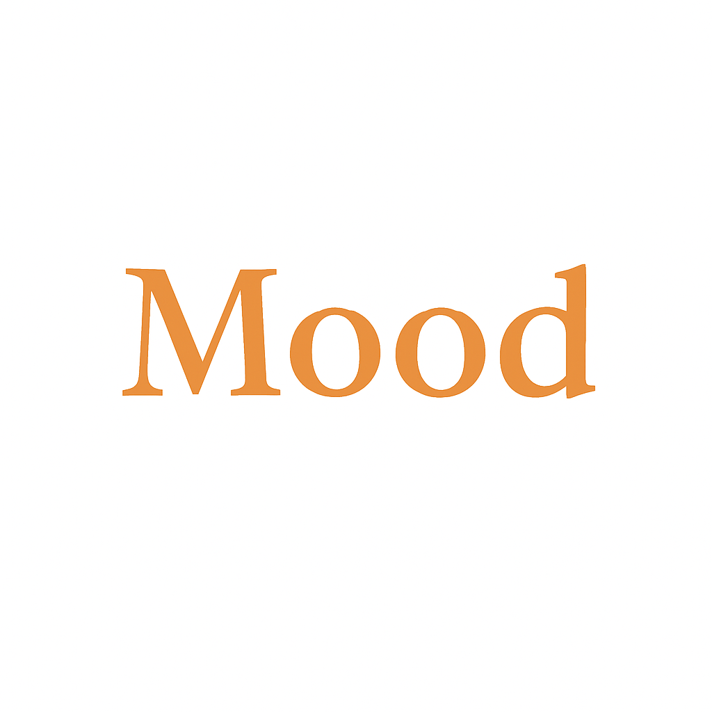
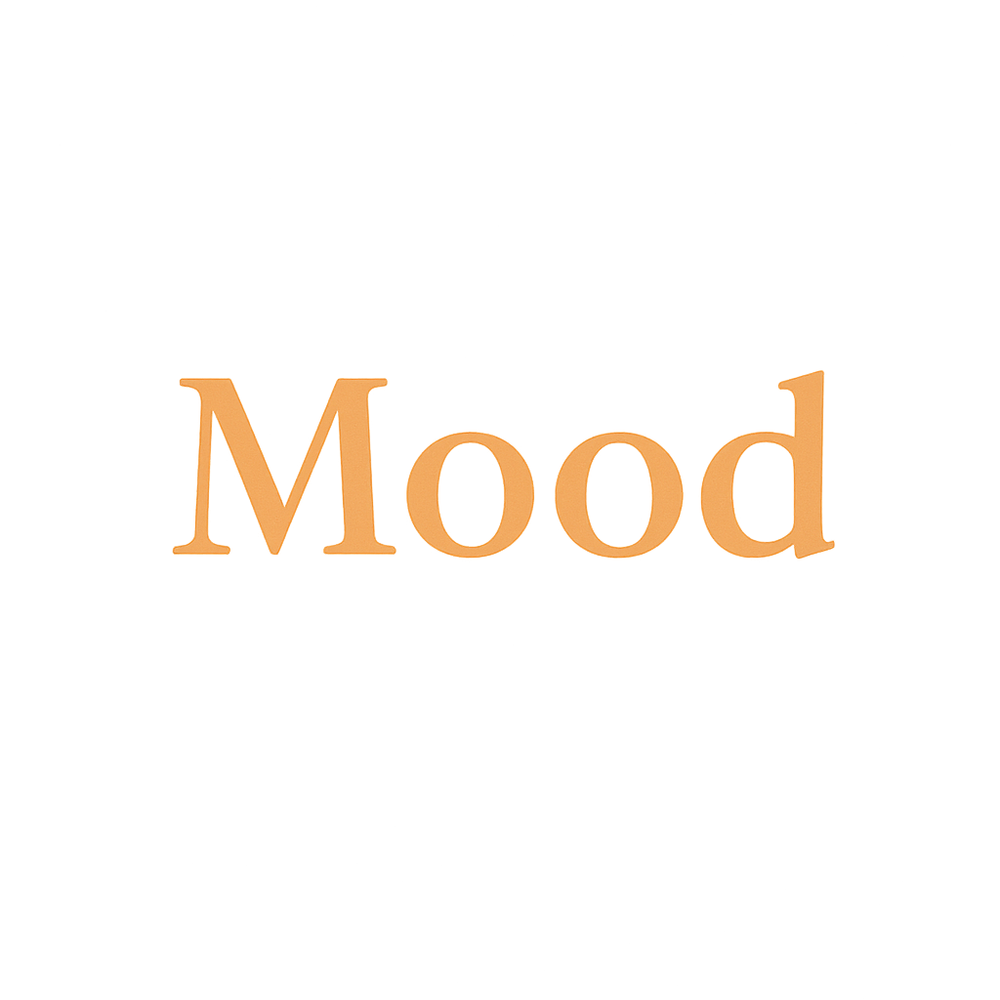

<div align="center">
  
  <h1>MOOD AVENUE</h1>
  <p>Track your daily mood and care for yourself with meaningful data</p>
  
  <a href="https://img.shields.io/badge/Flutter-3.x-blue?logo=flutter"></a>
  <a href="https://img.shields.io/badge/Dart-Null%20Safety-00B4AB?logo=dart"></a>
  <a href="https://img.shields.io/badge/Firebase-Firestore-ffca28?logo=firebase"></a>
  <a href="https://img.shields.io/badge/Platform-iOS%20%7C%20Android-black"></a>
</div>

<br />

<div align="center">
  
</div>

<br />

### Table of Contents
- [Overview](#overview)
- [Key Features](#key-features)
- [Architecture & Tech Stack](#architecture--tech-stack)
- [Screens](#screens)
- [Quick Start](#quick-start)
- [Developer Guide](#developer-guide)
- [Data Model & Firestore Structure](#data-model--firestore-structure)
- [Branding & Theme](#branding--theme)
- [Roadmap](#roadmap)
- [Contact](#contact)

---

### Overview
Mood Avenue is a personal project that turns emotions into data and visualizes your rhythm to help you understand yourself better. It aims for a warm, intuitive UX for users and a clean, modular structure for developers.

- Record your daily mood in seconds (1–5 scale + optional note)
- See monthly mood patterns on a calendar
- Receive quotes tailored to your average mood
- Lightweight user/data management powered by Firebase Firestore

---

### Key Features
- **Mood logging (1–5)**: One-tap, quick daily logging
- **Notes**: Add short context to your feelings
- **Calendar summary**: Monthly distribution and trends
- **Quote recommendations**: Based on recent average mood
- **Lightweight user identity**: Per-device UUID cached locally

---

### Architecture & Tech Stack
- **Flutter**: Multi-platform UI (iOS / Android)
- **Dart Null Safety**: Safer types and maintainability
- **Firebase (Firestore)**: Simple, scalable real-time DB
- **Shared Preferences**: Local UUID cache and lightweight settings

Structural highlights:
- `services/FirebaseService`: Single entry point for Firestore CRUD and core business logic
- `models/`: Explicit data models like `MoodRecord`, `Quote`, `User`
- `views/`: Split by feature screens – `home`, `calendar`, `settings`, `splash`
- `theme/`: Centralized color, typography, and component theming

Project layout:
```
lib/
  models/         # data models (mood_record, quote, user)
  services/       # FirebaseService and docs
  theme/          # colors, typography, styles, images
  views/          # screens (home, calendar, settings, splash)
  widgets/        # reusable UI components
  app.dart        # app root and routing
  main.dart       # entry point
```

---

### Screens
- **Splash**: Immediate brand tone
- **Home**: Pick today’s mood and see a suggested quote
- **Calendar**: Monthly heatmap-style summary
- **Settings**: Basic preferences (theme/personalization planned)

Preview:

<div align="center">
  
  &nbsp;&nbsp;&nbsp;
  
</div>

---

### Quick Start
Prerequisites:
- Flutter SDK 3.x+
- Firebase project configured for iOS/Android

Install & run:

```bash
flutter pub get
# iOS (first run)
cd ios && pod install && cd ..

# Debug run
flutter run
```

Firebase setup:
- Platform guides: `lib/services/FIREBASE_SETUP.md`
- Place `google-services.json` (Android) and `GoogleService-Info.plist` (iOS) after config

---

### Developer Guide
- Keep UI state simple per screen; centralize data access through `FirebaseService`
- Validate inputs and apply defensive coding in the service layer
- Enforce visual consistency via tokens in `theme/`
- Extract reusable UI into `widgets/`

Example: quote by recent average mood

```dart
final service = FirebaseService();
final quote = await service.getRandomQuoteByAverageMood(days: 7);
```

Example: save today’s mood

```dart
await FirebaseService().saveTodayMood(moodLevel: 2, note: 'Felt better after a walk');
```

---

### Data Model & Firestore Structure
- User: `users/{userId}`
- Mood record: `users/{userId}/mood_records/{yyyy-MM-dd}`
- Quote: `quotes/{autoId}`

See more schema and examples:
- `FIRESTORE_SUMMARY.md`
- `lib/services/firebase_usage_example.dart`

---

### Branding & Theme
The theme system includes:
- `app_colors.dart`: Brand palette and semantic color tokens
- `app_text_styles.dart`: Hierarchical typography
- `app_theme.dart`: Theme binding (ready to extend for Dark mode)

Design docs:
- `lib/theme/README.md`
- `lib/theme/README_TEXT_STYLES.md`

---

### Roadmap
- [ ] Refine calendar heatmap scaling
- [ ] In-app analytics dashboard (weekly/monthly/quarterly)
- [ ] Anonymous/social sign-in (optional)
- [ ] Internationalization (i18n)
- [ ] Official Dark theme support

---

Thanks for reading! This portfolio project is designed with production-grade code quality and scalability in mind. Please explore the clean structure, documentation, and polished design tone. 🚀


